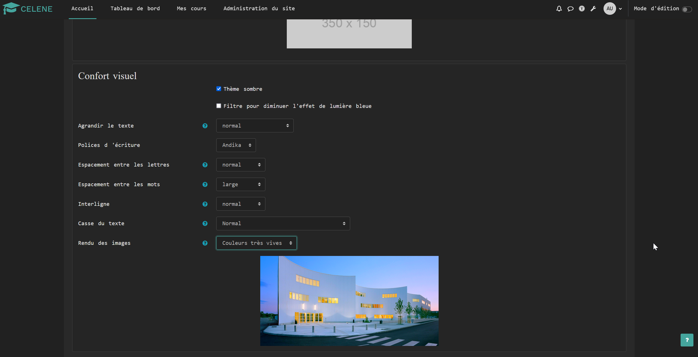
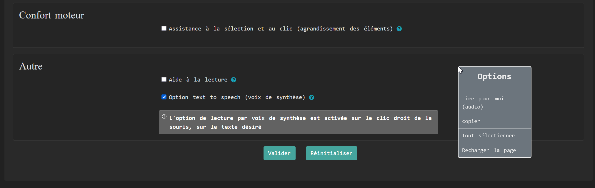
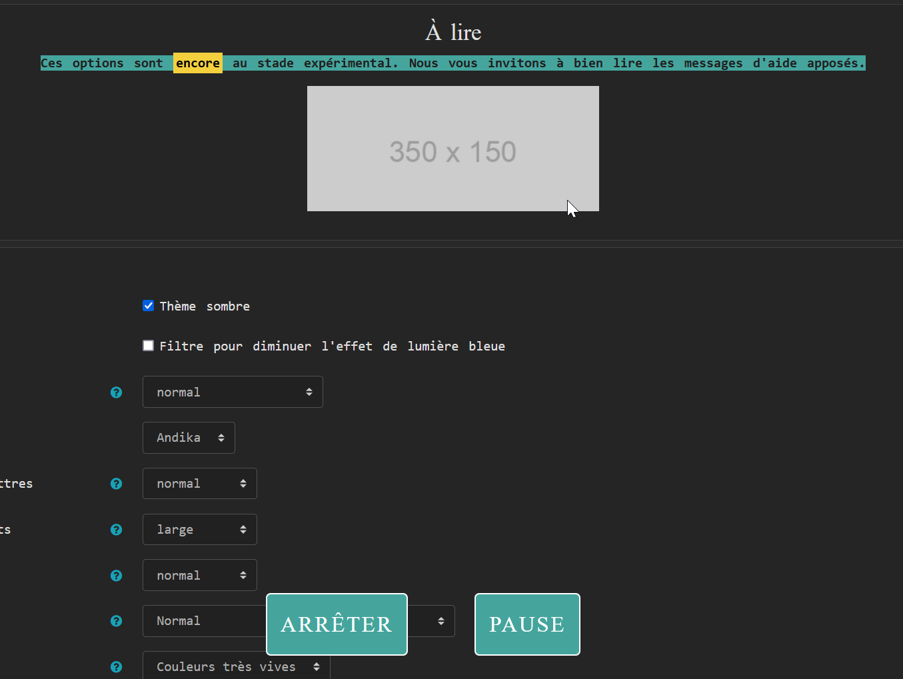

# Celeneaccessibility

## Important : This plugin is still in early bêta! It works fine so far but no "in depth" test has been performed yet.
Another important thing to take in consideration is that this plugin doesn't have the purpose to bypass moodle in core accessibility functionnality but to propose other tools to enhance / provide better experience if possible.
Even more important: In no way does this plugin should be used as an excuse for content writers to not follow accessibility rules. Moodle has several guidelines for good practices to follow when creating content and they should be respected from start to end.

### Why this plugin?
This plugin respond to a need to add more options for user experience we got from our students and teachers.
While being called it an accessibility plugin, it's more of an user experience improver.
We needed a tool to add more to the moodle "in core" accessibility which relies essentially on the teachers way of writtings their course without offering enough tools to enhance the display.
Some examples:

- Someone with visual deficiency may need to enlarge the text or may need to make the images' colors more vivid.

- The Dys community has even more issues to be addressed and writting this plugin was quite a challenge because we realised along the way that being a dys is being unique. Every dys has it's own way to apprehend reading and, overall, learning. Some needs special fonts while other will struggle with words, letters or line spacing. On another side of the spectrum, some have concentration trouble which can also be helped thanks to a reading helper which enhance only a couple of lines of reading while "caching" whats around, up and down.https://moodle.org/plugins/local_celeneaccessibilitykhttps://moodle.org/plugins/local_celeneaccessibility

- We also added a text to speech option. As much as a gadget as it seems, it may provide a usefull tool for some that do not have financial means to get a more professional tool.

The plugin is not really complicated in itself, the code is quite forward and relies essentially on the css to modify the pages. The trickiest was how to simplify the most possible the integration and adjustements needed into the theme's files as it doesn't seem possible yet to modify the theme renderer / drawers from a local plugin, (or i'm just not smart enough to figure how to! Frankly speaking it's more than probable).https://vinorodrigues.github.io/bootstrap-dark-5/

### Available options :
1. Dark theme
2. Blue light filter
3. Text size
4. Fonts choice
5. Letters spacing
6. Words spacing
7. Interline
8. Text case
9. Images' color rendering
10. Clic and selection improvment for motor impaired user
11. Reading guide line (activation on ESC key)
12. Text To Speech option (on right click)

## Theme necessities to use the plugin
```Important : Tested only with Moodle 4.0.4 to 4.1.1```
#### Pre-requisites
 - Ideally your theme should to be a child of the Boost theme.
 - The last moodle recommanded version of grunt needs to be installed.

#### List of the files
- **amd/src/guiding.js & amd/src/tts.js**  are both to enable the reading helper and the TTS option
- **layout/drawers.php** This is where the theme gets the user options from the database and sets the body classes
- **templates/drawers.mustache & head.mustache** 1st one is to dispatch body's classes, call the JS script and enable the reading helper

## What to do
You need to include these file into your child theme (or, if you're brave enough inside your boost theme. But it's more than VERY HIGHLY recommanded to use a child theme based on Boost).

Inside drawers.php don't forget to change the theme name !

Inside your theme you need to run the grunt command in order to compile the js files and be able to exploit them :
```shell
x$: cd path/to/your/moodle/theme/yourtheme
x$: grunt amd --force
```

### Potential error with Grunt
It's very unlikely if you use the last version of grunt & eshint but you may get an "err_func_loop" error from grunt when compiling.
This error is a false positive. You can either shut the error off by giving instruction to eshint or use the command --force
```
grunt amd --force
```

### The dark mode
It's the tricky part.
The way we worked around it is quite specific to our way of proposing the option before this plugin came to development.
We use the bootstrap plugin : https://vinorodrigues.github.io/bootstrap-dark-5/
The way it works :
We import the scss need file into the core.scss of our theme.
We trigger the night mode by adding a class to the HTML element.

The class is added through the drawers.php and the head.mustaches files.

If you use a method that use a class on body instead of the html element you'll need to change that into drawers.php and the template file head won't be necessary anymore.

** It should be noted that the bootstrap night mode isn't fully compatible with moodle and some adjustment (nothing too dramatic) may be needed into you css/scss file **

### How to activate
For user experience we made a custom link into the navbar (with fontawesome icon) but we, at first, made a custom link into the customusermenuitems.
If it's the chosen option, the way to do is pretty straight forward : Go to administration > presentation > theme settings and navigate down to the custom user menu items and inside it copy paste the following line : Accessibility|/local/celeneaccessibility/index.php

### Plugin settings
- The plugin has a setting page in the administration part of the site. It's nothing to tedious : It's to activate (or not) the TTS option, (we need it but it can be unnecessary).
- Same for the guiding line.
- Force the TTS default's language. This can be override by the user for him/herself. Only to language are proposed for the moment which are french and english.
- Administrator message : It's to write a text which'll be displayed on the user accessibility page.



